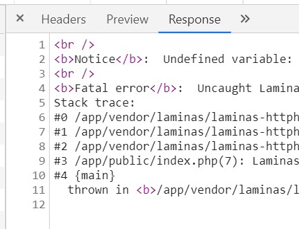
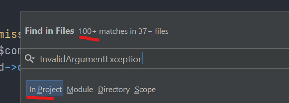
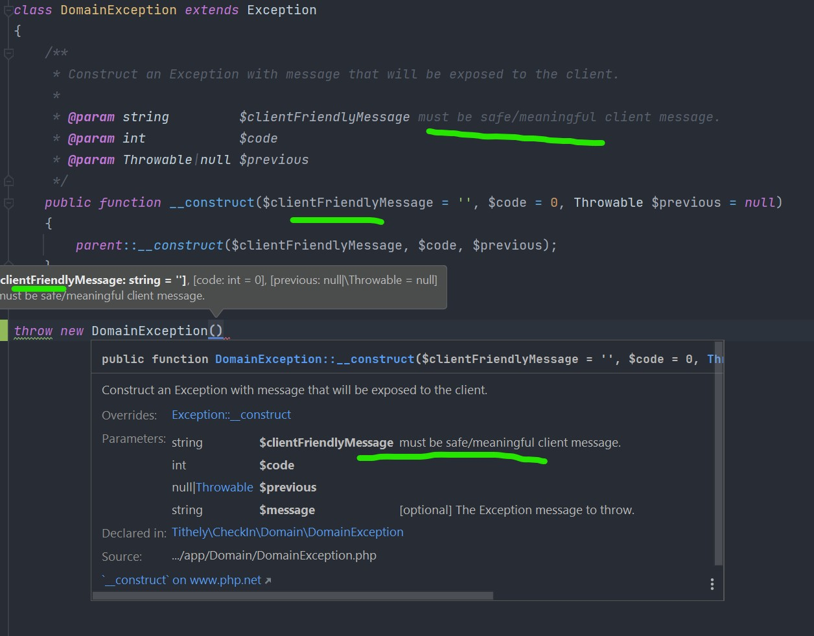

# Error and Exception handling in PHP

Exception and Error handling is probably a lot easier than you think.

I've seen a lot of code in my time and many of the common problems I've seen in Web and API projects have boiled down to a couple of simple misunderstandings.
Such as thinking you can't catch fatal errors without some magic framework, or thinking that catching \Exception makes you safe.

Let's destroy some misconceptions and hopefully guide others towards a more solid and much simpler setup in their project.

# The short version.
I've distilled it all down to 3 core principles.

1. Use a top-level try-catch that catches \Throwable instead of \Exception.
2. Only catch Exceptions you can handle.  (Below 👆 the top-level handler)
3. Only throw custom exceptions. (Discuss with your team first.)

If you are pressed for time just remember these 3 core principles and practice them in any new code you write.

### Optional 4th and 5th rules.
- Upgrade notices and warnings to catchable errors. (in dev env, production won't need this).
- Register a shutdown function (many would disagree the need for this).
  We will cover this much further down in...

# The long version.
Before explaining these core principles let me show you what triggers m.. er motivates me to write this. 😅

In my experience I have seen a lot of complex Exception juggling, catching converting, re-throwing, layer upon layer of try-catches, every class trying to prevent errors from escaping and resulting in problems such as:

- Too many try-catch layers duplicate code, confusion.
- Using dependencies in catch blocks that break causing a new unhandled error.
- Using global namespace exceptions for client messages or input validation.
- Catching and converting exceptions without appending the original one hiding the source of the problem.
- Loggers injected in classes all over the place logging problems independently with inconsistent behaviour.
- Errors with no logs at all.
- Copy-paste mentality spreading common mistakes.
- 200 ok response for fatal errors.



In production, you won't see this sensitive information because your DevOps team or service providers will disable error reporting.
However, developers also won't see it either (Well not where you expect if you have a custom logger).
Web projects may produce a blank nothing 😶, and API projects will confuse their consumers making them interpret it as a successful operation. 🤦‍️

This is one of many less-than-ideal situations you might have encountered.

Some are low risk or "shouldn't ever happen" but WHEN it does it will needlessly create time-consuming debug sessions where the problem was made unnecessarily harder to track.

With issues like this waiting to strike we may overcompensate by putting try-catch blocks all over the place while repeating the same mistake as the handlers above.

Fear not! Here is the missing piece 🧩.

Introducing [\Throwable](https://www.php.net/manual/en/class.throwable.php) interface. 🎉🥳🎊
```php
catch( \Throwable $e) {
    //now you catch errors AND exceptions 😎👍
}
```

This is very old news but seems many people are not aware of it or just don't realize they need to be using it.

I'd advise any team leaders to add this to your...

## Top Level Try Catch.
Catching and converting exceptions at multiple layers seems to happen a lot, and it's entirely unnecessary.

You only need to catch \Throwable in one place at the top level of execution and turn it into a generic 500 response.

Put this where your application handles request routing etc and generates/passes back responses.
If you don't use a framework or response objects then go all the way up to index.php and wrap everything like so:
```php
//index.php
try {
    $app = require_once 'setup_app.php';
    $app->run();
} catch (\Throwable $e) {
    //do generic 500 response.
}
```

This does not break any existing logic in your codebase.
I guarantee it 👌😉.

All your existing code will still operate as normal, the only difference is you now catch anything that slips past your old nets.

This is the first step. Let us refer to this *handler* as, **🤵🏼‍️Alfred**.

You can add more catch blocks and rely on 🤵🏼‍️Alfred to handle all the common situations that should end up with the same/similar response.

```php
...
    $app->run();
} catch (MoreSpecificException $e) {
    //more specific response for common situations.
} catch (\Throwa...
```
So 🦇Batman(that's you) can go off into the night while 🤵🏼‍️Alfred keeps your secrets and responds appropriately to the public on your behalf 👍.

Now you can stop repeating yourself repeating yourself in all your resources setting up safety nets all over the place. You also avoid one of the copy-paste problems I see where a resource returns the wrong response for an error and this mistake gets repeated in 100's of places because code is replicated and modified for new API end-points.

Just catch it once, in one place and return the appropriate response. If something is wrong, fix it once.

🤵🏼‍️Alfred's got your back now so...

## Only catch Exceptions you can handle.
Our Top-level net catches everything, so there is no need for you to have try-catch blocks all over your codebase.

Unless there is a very specific reason to do so, say if there's an "All or nothing" batch job that must be rolled back if one operation fails.
Then yes by all means add another try-catch layer and initiate the rollback in the catch block.
By the same token if you run into any situation you can't handle, just throw an exception.

Stop worrying about things you can't fix.

Ok, but I need to convert exceptions into other ex... 🤚🤨. No.
Converting an exception to another exception type (esp without appending the original exception object) just obscures the source of the error to the devs looking at the logs.

So you are concerned about exposing sensitive information to the client because you have been using `$e->getMesasage()` to pass validation errors back to the client.

This is why you...

## Only throw custom exceptions.
This is the next logical step in the progression.
Not sure how this trend caught fire, but I see this a lot.
People using  \InvalidArgumentException used to expose messages directly to the client.




I get it, using it for invalid request input makes sense on the surface, but also remember those [logic exceptions](https://www.php.net/manual/en/class.logicexception.php) are in the global namespace.

This means any 3rd party packages can throw them for any reason with any data we gave them or can access.
If it is global, assume it's not safe to expose it to the client.
I've seen it used to throw an error like this:
`'Error expected $someParameter to be an instance of \Some\Internal\Class with etc..'`
This was originally how this exception type should be used in reality, but, then it was treated the same as input validation errors directly exposing our internal workings to the client. 🙈

Some address this by catching them, checking the message and then convert... 🤚🤨. No.

A much better solution is to create custom exceptions and just throw a human-readable message in the first place. Then we just tell 🤵🏼‍️Alfred that any messages in these special CustomExceptionsForClient envelopes can be directly handed to our clients.
Common situations turned into appropriate responses via custom exceptions.

If your situation doesn't quite fit, create a new exception type and map it to the appropriate response in the handler.

## Exceptions types.
At Tithe.ly we practice many [Domain Driven Design](https://leanpub.com/ddd-in-php/read) principles (DDD). However, you can apply the same principles anywhere such as [command-line applications](https://packagist.org/packages/b-hayes/cli) 😉.

Here are my recommendations for custom exception implementations in DDD, and some added points on using the global ones.

### Create a custom DomainException.
As a base Exception for the Domain layer and any specific domain exceptions to extend from there.

I also recommend you override the `__contruct` but only to indicate to your devs that these should be client-friendly messages.



Think about it, Domain errors are always a violation of a business rule, a client-side mistake, and are often what you want to show the client.

You don't need to obscure things with snake_case_message_codes to be caught and converted into human-readable messages higher up.
The Exceptions can just be human-readable messages you want the client to read directly, coming directly from the domain layer that knows what it's talking about.

A good starting point for API's is to tell 🤵🏼‍️Alfred that any DomainException is a 400 `bad_request` with getMessage() handed directly to the client.
```php
catch (\project\Domain\DomainException $e) {
    return ApiResponseBuilder(400, 'bad_request', $e->getMessage());
}
```

### Create a custom ApplicationException.
Following the same principle for the Domain layer. These should also be client-friendly messages.

Application errors are in a similar boat and will often be some invalid input, or a domain rule that the domain layer is unable to enforce on its own such as `'only one person can use the same email address'`.
It could be a little technical in some cases like `'cats' is not a valid UUID` but it still doesn't expose sensitive information.

You will want to extend ApplicationException for granular response control eg.
* `\project\Application\AlreadyExistsException` becomes a 409.
* `\project\Application\RecordNotExistsException` becomes 404.
* `\project\Application\InvalidArgumentException` becomes 400.

You get the idea.

Doing this from scratch makes DDD a lot more useful, and makes the code much cleaner and easier to manage.

### ResourceExceptions
This would be used very sparingly within your REST API resources/controllers only.

They can be used to throw any response you see fit with 🤵🏼‍️Alfred using the error codes as response code.
```php
catch (\project\Controllers\ResourceException $r) {
   http_response_code($r->getCode());
   //set other headers based on code...
   //use getMessage() in response body... etc etc.
}
```
(we have a common setup for this in Tithe.ly but if we didn't already have one I'd suggest this.)
I'd also add a  set of constants on the ResponseException with the response codes mapped by name so devs get [the right status codes](https://restfulapi.net/http-status-codes/) with autocomplete suggestions from the IDE.

As I said tho, you won't need to use it much, but you will probably run into a situation where it will be useful.

### Infrastructure exceptions?
Nah.

I don't see a need for these as you will probably be talking about internal knowledge only devs can read, so you can just use a global \Exception in this case and let 🤵🏼‍️Alfred log it and return a generic 🤷‍.

This brings me back to...

### Global namespace exceptions
It's incredibly unlikely you need these anymore however, you may have a situation where only a developer should see this message, and only you can make it useful for him to read.

eg. Some PHP plugin is required for a specific operation and wasn't installed/enabled in production.
For these cases, you can throw \Error or \Exception or even \InvalidArgumentException once people stop using it for client messages of course 😆🤦‍️.

### DDD Dependency concerns.
"But you can't have dependencies on the domain layer!". Yes and no.

Technically that's not a rule in hexagonal architecture, and we already depend on Domain interfaces right? Let's dive into why.

The interfaces are to keep Domain away from implementation constraints while allowing it to tell us the concept to implement.
Generally, you avoid depending on the domain to avoid the domain having to change if that dependency changes. The domain layer can not be restrictive nor bound by the restrictions of other layers.

The point of hexagonal architecture is that the Domain doesn't know, care about, or have to adapt to implementations, and this will remain true with our exceptions and how we handle them.

DomainException has no ties so make its messages client-friendly and let em fly 🕊.

## QOL for developers.
🤵🏼‍️Alfred isn't there when you're building components in the bat cave, which is great.

Error handling, logging and all of this junk are now absent during Unit-tests because its all done in the entry point only used for production.

So we simply see errors and fix them. Nice.

But when it comes to testing the full API stack locally with an API client, we have to squint at stack traces crammed into a log file 🤮. So let's take things a step further.

Now that we have 🤵🏼‍️Alfred we can tell him to drop the formalities when its just between us and give detailed information in dev testing.
```php
} catch (\Throwable $e) {
    $response = [...
    ...
    //some conditions only local dev machines will have, or have to set up.
    if (getenv('LOCAL_DEV' === 'yes its just us')) {
        $response['message'] = $e->getMessage();
    }
    ...
```
I took this even further in one of our projects by adding a prettified stack trace into the JSON response, so it is super easy to read from insomnia/postman/browser tools.
```php
if (getenv('LOCAL_DEV' === 'yes its just us')) {
    // Add a readable stack trace for local developers
    $response['error_details'] = [
      'message' => $exception->getMessage(),
      //strip out the paths segments from inside the docker container
      'file' => str_replace('/container/path', '', $exception->getFile()),
      'line' => $exception->getLine(),
      //make the stack trace an expandable array/object in the client
      'stack_trace' => explode(
          "\n",
          str_replace(
              '/container/path',
              '',
              $exception->getTraceAsString()
          )
      )
    ];
}
```
The next level of this would be to make them into Jetbrains URL's, so you can just click to open the file at the exact line the error occurred, but this might be going too far. 🤓

One other problem for developer environments is we have notices and warnings enabled that can just wreck all nice behaviours.

This is why you might want to apply the...

## Optional 4th rule => Upgrade Notices and Warnings into Errors.
They are non-fatal, but we still want to see them, however,
the classic "output started before headers sent" and similar problems occur where when non-fatal notices and warnings can cause fatal errors that break development and bypass all our attempts to log and catch and report errors in nice ways😒.

In my opinion, a notice or a warning is a potential error waiting to happen and should be treated as such.

These can be captured with legacy handlers. Different from Exception handling, this is an old error mechanism used back in the day 👴, and it is still used in PHP 7+ for non-fatal notices and warnings only.
So lets convert them into exceptions with [set_error_handler()](https://www.php.net/manual/en/function.set-error-handler.php) and treat them the same way as fatal errors.

We can implement an error handler to throw an [\ErrorException](https://www.php.net/manual/en/class.errorexception.php) that was introduced for this very purpose.
```php
set_error_handler(function ($severity, $message, $file, $line) {
    if (!(error_reporting() & $severity)) {//bitwise comparison
        // php isnt reporting this error so do nothing.
        return;
    }
    throw new \ErrorException($message, 0, $severity, $file, $line);
});
```
Instead of seeing a fatal side effect, you just see the notice/warning as an error instead.
Nice!

## Optional 5th rule => Register a shutdown function.
What if PHP itself crashes due to a fatal error. Hoe can it execute your try catch if the php process is no longer running?
// TODO : fix this section up.
```php
function fatality()
{
    $error = error_get_last();

    if ($error && $error['type'] === E_ERROR)
    {  
        //log the error without any dependencies that could break.
    }
}

register_shutdown_function('fatality');
```

# Edge cases.
Let's cover some additional situations that might pop up.

## Deprecation notices.
Deprecations from 3rd party libraries can not be fixed quickly without refactoring or library upgrade in a separate PR and can leave devs in a position where notices are ruining their lives.

So you might want to specifically handle these in your "4th rule" implementation.
```php
if ($severity == E_DEPRECATED || $severity == E_USER_DEPRECATED) { /*silently log this away*/ }
```
You could just disable reporting of deprecation notices, but we want to know about these and address them at some point.

## 🤵🏼‍️Alfred needs to use complex libraries. 🤹
Let's say your top-level try-catch needs to translate your client messages into other languages, use a logger library, or for some reason have to use some big process that could crash while creating a response 🤣.

If the top-level exception handler needs complex libraries then you must have🥁.... 2, yes 2, top-level exceptions handlers 🧛‍️ ah ah ah.

Have your main handler inside your application and then an extra try-catch outside the entire application that avoids the use of any dependencies like so:
```php
//index.php
try {
    $app->run(); //move 🤵🏼‍️Alfred🤵🏼‍️ in here
} catch (\Throwable $e) {
    //respond without any dependencies
    header('HTTP/1.1 500 Internal Server Error');
    http_response_code(500);
    echo json_encode(
        [
            'error' => [
                'status' => 'internal_server_error',
                'message' => 'An unexpected internal server error has occurred.'
            ]
        ]
    );
}
```
If you can't move 🤵🏼‍️Alfred inside the application you can just nest the try catches, I'd move things around for readability even if it's just renaming your old index.php and include it in a new one.
```php
//new index.php
try {
    require_once 'run_app.php';//old index.php with 🤵🏼‍️Alfred.
} catch {
    //respond without any dependencies...
}
```

## Too many exception types.
A friend of mine told me of an issues he faces where people keep creating new exceptions instead of using existing ones, so I thought I'd address this quickly.
You should discuss this and introduce 🤵🏼‍️Alfred to your team so everyone knows what's going on.

This isn't really a problem when everyone meets 🤵🏼‍️Alfred.

As soon as I go to the handler and map my new exception type to a response I'll see right away, oh... there is already an exception for this scenario. Cool. *deletes new exception and uses old one*

# Wrap up.
This explanation might be excessive and seem like common sense to some but, I feel people must have some misconceptions of how simple exceptions handling can be once you make your own exceptions for your own purposes.

If you read all of this, thank you I hope you got some value out of it.
